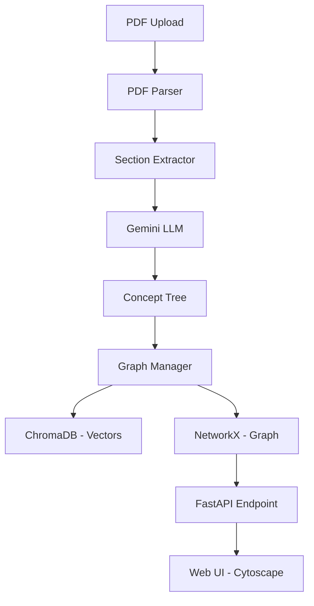

# ScholarGraph Architecture

ScholarGraph is an AI-powered system that transforms research papers (PDFs) into structured, hierarchical knowledge graphs. It uses LLMs to extract core concepts and vector databases to link them semantically across multiple papers.

## System Architecture

## Core Components

### 1. PDF Processing (`pdf_parser.py`)
- **PyMuPDF (fitz)**: Extracts raw text from uploaded PDFs.
- **Section Extraction**: Logic to identify and extract key sections like Abstract, Introduction, and Conclusion.

### 2. Concept Extraction (`tree_generator.py`)
- **Gemini Pro (via LangChain)**: Analyzes extracted text to generate a hierarchical JSON representation of concepts.
- **ConceptNode Model**: Pydantic models define the structure of these concepts (label, summary, children).

### 3. Knowledge Graph Management (`graph_manager.py`)
- **Sentence-Transformers**: Generates 384-dimensional embeddings (using `all-MiniLM-L6-v2`) for each concept.
- **ChromaDB**: Persistently stores concept embeddings for semantic retrieval.
- **NetworkX**: Maintains the global graph structure, tracking both hierarchical (parent-child) and cross-paper (semantic similarity) edges.
- **Similarity Linking**: Automatically creates edges between concepts across different papers if their cosine similarity exceeds a threshold (default: 0.85).

### 4. Backend API (`main.py`)
- **FastAPI**: Provides endpoints for uploading papers and retrieving global graph data.
- **Static File Serving**: Serves the frontend web interface.

## Data Flow

1. **Upload**: User uploads a PDF via the Web UI.
2. **Parse**: The backend extracts key sections (Abstract, Intro, Conclusion).
3. **Generate**: Gemini processes the sections to create a hierarchical tree of concepts.
4. **Embed**: Each concept is embedded into a vector space.
5. **Store**: Embeddings and metadata are saved in ChromaDB.
6. **Link**: The system queries ChromaDB for semantically similar concepts and creates cross-paper links.
7. **Serve**: The updated graph (NetworkX) is serialized and sent to the frontend for visualization.
